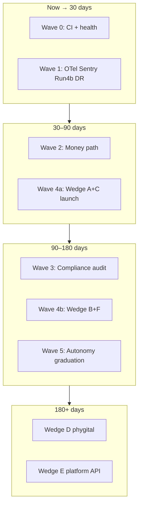

# Commercial GA Strategy & Implementation Plan

> **Status:** Active (2026-06-22)
> **Owner:** Selva product + MADFAM platform operator
> **Audience:** Leadership, GTM, engineering leads, investors
> **Companion docs:**
> - [COMMERCIAL_GA_REMEDIATION_PLAN_2026-06-04.md](./COMMERCIAL_GA_REMEDIATION_PLAN_2026-06-04.md) — CGA-0..9 gate contract
> - [FULL_REMEDIATION_PLAN_2026-06-22.md](./FULL_REMEDIATION_PLAN_2026-06-22.md) — engineering wave index
> - [BENCHMARK.md](./BENCHMARK.md) — feature parity matrices
> - [AUTONOMOUS_OPERATIONS_PROGRAM.md](./AUTONOMOUS_OPERATIONS_PROGRAM.md) — Phases 0–6 north star

---

## 1. Executive thesis

**Selva is not a virtual office that has AI. It is an AI workforce that has a virtual office.**

The pixel-art office at `selva.town` is the **control plane** for autonomous agents that code, email, deploy, bill, campaign, and (via the MADFAM ecosystem) comply with Mexican tax and privacy law. Humans supervise through gamified HITL — walking the map, approving at review stations, watching the ops feed — not by configuring YAML in a terminal.

**Category placement:** Selva competes with agent orchestration platforms (CrewAI, LangGraph, Hermes-class harnesses) and enterprise autonomous ops (ServiceNow AI, Salesforce Einstein) more than with Gather or Roam. Virtual-office competitors optimize human-to-human presence; Selva optimizes **human-to-AI orchestration with bounded autonomous execution**.

---

## 2. Masterfulness assessment (June 2026)

Honest read across architecture, product, operations, and monetization.

| Lens | Score | Summary |
|------|:-----:|---------|
| **Architecture & agent depth** | 9/10 | LangGraph workers, 268+ tools, HITL permission engine, RLS multi-tenant, idempotency, voice/consent ledger, visual workflows, A2A, ops feed — top-tier stack depth |
| **Gamified productivity UX** | 7/10 | Distinctive solarpunk office, proximity AV, on-map approvals, demo mode; not Roam/Gather-grade human presence or native mobile |
| **Production maturity (selva.town)** | 6/10 | Core services up, queue healthy, promotions rolling; observability blind until Wave 1 operator gates close; load limits uncalibrated |
| **Monetization proof** | 5/10 | Billing architecture live (Dhanam path); attributed paid conversion and public case study not yet closed |
| **Commercial GA readiness** | **58–65%** | Per [COMMERCIAL_GA_REMEDIATION_PLAN](./COMMERCIAL_GA_REMEDIATION_PLAN_2026-06-04.md) — blocked by evidence and GTM, not vision |

**MADFAM tenant slice (`admin@madfam.io`):** ~85–90% operationally usable for internal deterministic workflows.

**Production-truthful Selva baseline:** ~88–92% (security, tenancy, correctness patterns largely implemented).

**Gap type:** Operational evidence + revenue proof + non-MADFAM product polish — not fundamental capability.

---

## 3. Competitive landscape

Full feature matrices live in [BENCHMARK.md](./BENCHMARK.md). This section captures **strategic positioning** and **parity vs “and then some.”**

### 3.1 Category A — Virtual offices (Gather, Roam, Kumospace, WorkAdventure)

| Dimension | Competitors | Selva |
|-----------|-------------|-------|
| Core job | Remote team presence | AI workforce supervision |
| AI on map | Roam: 1 assistant | **10 named agents, 4 departments** |
| Autonomous dispatch | ❌ | ✅ HeartbeatService + CRM playbooks |
| Tool execution | ❌ | ✅ 268+ built-in tools |
| Pricing model | $7–20/seat/mo (humans) | Agent-hour metered packs (see §7) |

**Parity:** ~40% on human collaboration features (video polish, mobile, game rooms).

**Strategic implication:** Do not compete on “make remote work feel fun.” Compete on **replace headcount with supervised agents.**

### 3.2 Category B — Agent frameworks (CrewAI, LangGraph, MS Agent Framework, Hermes)

| Dimension | Frameworks | Selva |
|-----------|------------|-------|
| Delivery | Library / SDK | Full product (UI + API + workers + realtime) |
| Tenancy | DIY | PostgreSQL RLS strict mode, audience filter |
| HITL | DIY | PermissionEngine + approval WS + office UX |
| Billing | DIY | Dhanam integration, tier limits, token ledger |
| Ops | DIY | Ops feed, metrics dashboard, DLQ, task board |

**Parity:** ~85% on orchestration primitives.

**And then some:** Gamified control plane, ecosystem integrations, production guardrails (financial caps, consent ledger, SSRF-hardened tools).

### 3.3 Category C — Dev AI (Copilot Workspace, Devin-class)

| Dimension | Dev AI | Selva |
|-----------|--------|-------|
| Scope | Code / PR | Code + CRM + email + deploy + campaigns |
| Graph | Single-repo | Multi-graph (coding, CRM, meeting, campaign, puppeteer, custom YAML) |
| Infra tools | Limited | K8s, Enclii, git PR, deploy preflight |

**Parity:** ~70% on coding agent depth.

**And then some:** Full business operations graph, not just PR factory.

### 3.4 Category D — Enterprise autonomous ops (ServiceNow AI, Salesforce Einstein)

| Dimension | Enterprise | Selva |
|-----------|------------|-------|
| Brand & SCIM | Mature | Roadmap (Janua SSO live; SCIM Phase 3) |
| Compliance narrative | SOC2 packages | MX-native: Karafiel CFDI, consent ledger, voice modes |
| Ecosystem | Walled gardens | **14 MADFAM platforms** composable |

**Parity:** ~30% on enterprise admin *evidence* today.

**And then some:** Phygital pipeline, Tulana campaign loop, inference gateway for whole ecosystem.

### 3.5 Where Selva wins outright (no direct competitor match)

1. **Autonomous AI workforce on a spatial control plane** — agents visible, status-coded, approvable on-map
2. **14-platform MADFAM ecosystem** — CRM, billing, legal, tax, 3D, fab, MES, pricing intel in one operating story
3. **Mexico / LATAM compliance moat** — LFPDPPP consent, voice-mode outbound, SAT/CFDI path
4. **Inference control plane** — OpenAI-compatible `/v1` proxy; ecosystem token economics flow through Selva
5. **Security as product** — platform vs tenant tool audience, RLS strict mode, idempotent mutations, append-only consent ledger
6. **Phygital quote-truth** (Phase 3) — design → quote → manufacture → invoice in one audited graph

### 3.6 Where competitors still win (acknowledged gaps)

| Gap | Leaders | Selva plan |
|-----|---------|------------|
| Human presence / video | Roam, Gather | Not core wedge; LiveKit SFU staged |
| Native mobile | Roam, Gather | PWA today; React Native Phase 2 |
| Free tier / PLG | Gather | Demo mode + `/demo`; paid GA is B2B |
| Enterprise SCIM / analytics | Roam | Phase 3 SCIM via Janua |
| Community / dev mindshare | CrewAI, LangGraph | SDK + docs + inference API GTM (Wedge E) |

---

## 4. Unfair and unique advantages

These are **defensible moats** — hard to copy without the MADFAM stack and MX focus.

| # | Advantage | Why it’s unfair | Monetization lever |
|---|-----------|-----------------|-------------------|
| 1 | **MADFAM vertical OS** | 14 integrated services; competitors are point solutions | Bundle pricing, ecosystem lock-in |
| 2 | **MX compliance stack** | Karafiel + consent ledger + voice modes + Tezca | Enterprise premium in regulated outbound |
| 3 | **Inference gateway** | All sibling LLM traffic routes through Selva | Token markup + routing policy |
| 4 | **Gamified HITL** | Supervision is spatial and intuitive vs agent logs | Higher retention, faster onboarding |
| 5 | **Phygital pipeline** | Quote-truth from design to CFDI | Fab/studio vertical (100x vs manual ops) |
| 6 | **Production security posture** | RLS, audience filter, SSRF, financial caps | Regulated tenant sales |
| 7 | **Campaign factory** | Tulana SKU → Selva graph → Phynd → buyer signal | Growth-team wedge |
| 8 | **Operator template** | MADFAM 10-agent roster as reference architecture | “Operator-in-a-box” enterprise SKU |

---

## 5. 100x-value wedges (GTM)

Prioritized by ROI, evidence proximity, and moat strength.

### Wedge A — Autonomous revenue desk (highest priority)

**Promise:** CRM hot lead → agent draft → HITL approve → email → Dhanam checkout → tier upgrade → Karafiel CFDI.

| Item | Detail |
|------|--------|
| **Buyer** | MX SMBs, agencies, B2B services |
| **100x vs** | SDR + bookkeeper + compliance consultant |
| **Pricing** | Studio/Enterprise Tulana packs + Dhanam subscription |
| **GA gate** | CGA-4, Phase 1 exit |
| **Evidence** | One attributed paid conversion record |

### Wedge B — Campaign factory

**Promise:** Tulana SKU packs → ranked campaign lanes → HITL social → CRM handoff → buyer-signal feedback.

| Item | Detail |
|------|--------|
| **Buyer** | Growth teams, SKU-led businesses |
| **100x vs** | Agency retainers + disjoint MarTech |
| **Status** | API loop green on staging; UI soak optional |
| **GA gate** | Campaign GA docs + CGA-7 |

### Wedge C — Compliance-grade outbound agents

**Promise:** Voice-mode + consent ledger + SPF + HITL on every marketing send.

| Item | Detail |
|------|--------|
| **Buyer** | Fintech, health, legal, LFPDPPP-sensitive outbound |
| **100x vs** | Regulatory fines + manual legal review |
| **GA gate** | CGA-6, consent-ledger health probe |
| **Moat** | Append-only ledger, per-key rotation |

### Wedge D — Phygital studio OS (highest differentiation, longest build)

**Promise:** Yantra4D design → Cotiza quote → Pravara work order → Karafiel invoice — quote-truth invariant.

| Item | Detail |
|------|--------|
| **Buyer** | Fab labs, industrial designers, custom manufacturing (MX) |
| **100x vs** | Quote drift, manual SAT, fulfillment errors |
| **Program phase** | Autonomous Operations Phase 3 |
| **GA gate** | CGA-8 + recorded demo |

### Wedge E — Inference + agents platform (API / white-label)

**Promise:** OpenAI-compatible `/v1` + tenancy + billing + tool registry for ISVs.

| Item | Detail |
|------|--------|
| **Buyer** | MADFAM siblings first, then external ISVs |
| **100x vs** | Build LangGraph + RLS + billing yourself |
| **Unlock** | Phase 0 exit + SDK SLA doc |

### Wedge F — Operator-in-a-box

**Promise:** Pre-rostered departments and agents (MADFAM template) for founders.

| Item | Detail |
|------|--------|
| **Buyer** | Founders replacing 4–6 FTE functions |
| **100x vs** | Headcount cost |
| **Proof** | MADFAM slice at ~85–90% |

### Wedge priority order (GTM + engineering)

```
A (revenue desk) → C (compliance outbound) → B (campaigns) → F (operator template) → E (API) → D (phygital)
```

---

## 6. Pricing and unit economics

**Canonical source:** [infra/pricing/selva-tiers.json](../infra/pricing/selva-tiers.json) (CI drift-gated).

| Pack | Rate (MXN) | Unit | Ideal for |
|------|------------|------|-----------|
| Maker Pack | 85/hr | agent-hour | Solo operator |
| Studio Pack | 170/hr | agent-hour | Small team workflows |
| Enterprise Pack | 255/hr | agent-hour | Multi-team / regulated |

**Dhanam subscription tiers** (daily compute limits): starter 1,000 / professional 5,000 / enterprise 25,000 tokens/day — same JSON file.

**Positioning vs virtual offices:** Competitors sell **human seats** ($7–20/mo). Selva sells **agent labor substitution** (metered agent-hours). The comparison anchor is headcount, not Zoom.

> Note: [BENCHMARK.md](./BENCHMARK.md) §Pricing still cites legacy $149–499/seat figures — treat Tulana JSON as authoritative until BENCHMARK is refreshed.

---

## 7. Implementation plan → full commercial GA

This plan **maps wedges to CGA gates** and **engineering waves**. Do not declare broad tenant GA until **M5** (all CGA-0..9 evidenced).

### Phase map (time horizons)



### 7.1 Wave 0 — CI + prod hygiene (complete in repo, deploy verify)

| Work | Owner | Exit | CGA |
|------|-------|------|-----|
| CVE bumps (pyjwt, multipart, starlette) | Eng | CI green on `main` | — |
| `COLYSEUS_URL` + consent probe fix | Eng + Ops | `verify-doc-truth.sh` | CGA-6 partial |
| PR #193 merged + prod promote | Ops | Argo sync | — |

**Post-deploy verify:**
```bash
./scripts/verify-doc-truth.sh
```

### 7.2 Wave 1 — Operational proof (weeks 1–2)

**Runbook:** [WAVE1_OPERATOR_RUNBOOK.md](./WAVE1_OPERATOR_RUNBOOK.md)

| Work | Owner | Script / artifact | CGA |
|------|-------|-------------------|-----|
| OTel + Grafana Cloud | Operator | `bootstrap-staging-observability.sh`, `verify-observability-trace.sh --require-trace` | **CGA-3** |
| Sentry DSNs (6 services) | Operator | `verify-sentry-capture.sh --require-capture` | **CGA-3** |
| k6 Run 4b | Eng + Ops | `run-staging-load-calibration.sh`, [LOAD_TEST_2026-Q2.md](./LOAD_TEST_2026-Q2.md) | **CGA-5** |
| DR drill | Operator | `run-db-restore-drill.sh`, [dr-drills/TEMPLATE.md](./dr-drills/TEMPLATE.md) | **CGA-5** |
| Gate bundle | Operator | `run-wave1-gates.sh --staging --require-all` | M1 |

**Milestone:** M1 Phase 0 exit → unlock Wave 2.

### 7.3 Wave 2 — Money-path proof (weeks 2–4)

**Unlocks Wedge A.**

| Work | Owner | Exit | CGA |
|------|-------|------|-----|
| Dhanam price→tier map (prod + staging) | Operator | `verify-dhanam-price-tier-map.sh --require-all` | **CGA-4** |
| Webhook fan-out + HMAC replay | Operator + Eng | `verify-dhanam-billing-path.sh` | **CGA-4** |
| Staging revenue loop | Eng + Ops | lead → checkout → tier → budget change | **CGA-4** |
| Prod attributed conversion | Ops + GTM | dated evidence row (see template below) | **CGA-4**, M4 |
| Karafiel CFDI artifact (if in scope) | Ops | invoice ref linked to conversion | **CGA-4** |

**Revenue proof record template** (store in `docs/evidence/` or operator vault):

| Field | Example |
|-------|---------|
| `lead_id` | `crm-…` |
| `org_id` | tenant UUID |
| `customer_id` | Stripe/Dhanam |
| `tier_before` / `tier_after` | starter → professional |
| `checkout_session_id` | … |
| `invoice_ref` / CFDI UUID | … |
| `executed_at` | ISO8601 |

### 7.4 Wave 3 — Compliance & audit (month 2)

**Unlocks Wedge C at scale + enterprise sales.**

| Work | Owner | Exit | CGA |
|------|-------|------|-----|
| RFC 0019 Phase A (CDC / audit query) | Eng | tenant event query without manual DB | **CGA-8** |
| RFC 0018 Phase D (A2A per-caller tenant) | Eng | before paying A2A callers | **CGA-8** |
| RFC 0020 residency (SAT-bound tenants) | Eng + Ops | topology + data map doc | **CGA-8** |
| Secret rotation Q3 evidence | Operator | `verify-secret-rotation-schedule.sh` | Ops |
| Consent ledger prod probe green | Ops | `consent-ledger-grants` 200 | **CGA-6** |

### 7.5 Wave 4 — Product GA polish (months 2–3)

**Unlocks Wedge B, F, and non-MADFAM tenants.**

| Work | Owner | Exit | CGA |
|------|-------|------|-----|
| Onboarding + outbound identity for external tenants | Eng + Product | `/onboarding` + `/settings/outbound-identity` E2E | **CGA-7** |
| Billing status UI | Eng | tier + usage visible, no placeholders | **CGA-7** |
| Campaign dashboard UI soak | Operator | staging Tulana import → HITL → handoff | **CGA-7** |
| Live-mode guards on internal features | Eng | feature flags documented | **CGA-7** |
| Mobile approval/dispatch a11y pass | Eng | core flows WCAG smoke | **CGA-7** |
| Terms, privacy, unsubscribe, support entry | GTM + Legal | linked from office-ui | GTM row |
| SCIM (Janua) | Eng | enterprise SSO provisioning | Enterprise gap |

### 7.6 Wave 5 — Autonomy graduation + commercial cutover (month 3+)

**Unlocks scaled outbound without operator babysitting.**

| Rule | Detail |
|------|--------|
| Default | All outbound lanes **ASK** |
| Promote to ALLOW | 30-day clean run, zero consent incidents, no SLO burn, operator sign-off |
| Never ALLOW without evidence | LinkedIn stays draft-only |
| Strong ASK forever | Deploy, secrets, billing mutations, destructive ops |

**CGA-9 evidence:** per-lane graduation log in operator backlog.

### 7.7 Horizon — Wedge D & E (months 4–9)

| Wedge | Program phase | Key deliverable |
|-------|---------------|-----------------|
| D — Phygital | Phase 3 | Recorded design → invoice demo; [phygital quote-truth RFC](./rfcs/phygital-quote-truth-contract.md) |
| E — Platform API | Phase 5 partial | SDK SLA, `/v1` rate cards, tenant onboarding API |

---

## 8. CGA gate tracker (living)

Sync with [COMMERCIAL_GA_REMEDIATION_PLAN](./COMMERCIAL_GA_REMEDIATION_PLAN_2026-06-04.md). Update `Current status` column as evidence lands.

| Gate | Requirement | Status (2026-06-22) | Next action |
|------|-------------|----------------------|-------------|
| CGA-0 | Explicit env targeting | ✅ Policy | Maintain |
| CGA-1 | Tenant propagation | ✅ Repo; rollout evidence | Post-promote smoke |
| CGA-2 | Dispatch contracts | ✅ Repo | Keep CI tests green |
| CGA-3 | Actionable observability | ❌ Open | Wave 1 operator runbook |
| CGA-4 | Billing + attribution | 🔄 Partial | Dhanam map + conversion |
| CGA-5 | Load + recovery | 🔄 Partial | Run 4b + DR drill |
| CGA-6 | Outbound governance | 🔄 Mostly | Consent probe on prod |
| CGA-7 | Placeholder-free live paths | 🔄 Improved | Wave 4 product pass |
| CGA-8 | Audit / compliance queryable | 🔄 Partial | RFC 0019/0018/0020 |
| CGA-9 | Autonomy graduation policy | 🔄 Partial | Lane logs |

**Commercial GA % estimate trajectory:**

| Milestone | Target GA % |
|-----------|-------------|
| Today | 58–65% |
| M1 (Phase 0 exit) | ~70% |
| M4 (revenue proof) | ~78% |
| M5 (all CGA green) | **100%** (evidence-based) |

---

## 9. GTM sequencing

| Horizon | Focus | Wedges | ARPU driver |
|---------|-------|--------|-------------|
| **0–90 days** | Evidence + 3 MX design partners | A, C | Agent-hours + Dhanam tiers |
| **90–180 days** | Campaign + operator template | B, F | Studio → Enterprise upsell |
| **180+ days** | Phygital + platform API | D, E | Project fees + token markup |

**Do not** run broad PLG or global launch until M4 + CGA-3/5 are green.

**Do** sell Wedge A/C to regulated MX outbound buyers as a **design partner program** with explicit evidence milestones.

---

## 10. Risks and mitigations

| Risk | Impact | Mitigation |
|------|--------|------------|
| Observability gap | Incidents invisible | Wave 1 — non-negotiable |
| Unproven load limits | Cost blowout at scale | Run 4b → tune `MAX_CONCURRENT_TASKS`, dispatch limits |
| Billing drift | Wrong tier enforcement | Dhanam `--require-all` + webhook reconcile script |
| Over-promising GA | Trust loss | Evidence-based CGA gates only |
| Competing on Gather axis | Wrong buyers, wrong pricing | Messaging: workforce substitution |
| Phygital too early | Distraction | Wedge D only after A+C revenue proof |

---

## 11. Weekly scorecard (leadership)

| Metric | Baseline (Jun 22) | Phase 0 exit | Commercial GA |
|--------|-------------------|--------------|---------------|
| CI green on `main` | Fixing (PR #193) | 7d green | Continuous |
| OTel traces in prod | 0 | ≥1 dispatch trace | SLO dashboards live |
| Sentry services | 0/6 | 6/6 capturing | Alert routing |
| Run 4b thresholds | Failed | Pass | Re-validate quarterly |
| DR drill | None | RTO/RPO logged | Quarterly drill |
| Attributed conversion | 0 | 1 staged | 1 prod + case study |
| CGA gates green | 3/10 | 6/10 | 10/10 |
| Commercial GA % | 58–65% | ~70% | 100% |

---

## 12. Document map

| Question | Read |
|----------|------|
| What is our competitive story? | This doc §2–5 |
| Feature-by-feature parity? | [BENCHMARK.md](./BENCHMARK.md) |
| What blocks GA technically? | [COMMERCIAL_GA_REMEDIATION_PLAN](./COMMERCIAL_GA_REMEDIATION_PLAN_2026-06-04.md) |
| What do engineers run this week? | [FULL_REMEDIATION_PLAN](./FULL_REMEDIATION_PLAN_2026-06-22.md) + [WAVE1_OPERATOR_RUNBOOK](./WAVE1_OPERATOR_RUNBOOK.md) |
| What is blocked on a human? | [OPERATOR_BACKLOG](./OPERATOR_BACKLOG.md) |
| Long-term north star? | [AUTONOMOUS_OPERATIONS_PROGRAM](./AUTONOMOUS_OPERATIONS_PROGRAM.md) |

---

## Changelog

| Date | Change |
|------|--------|
| 2026-06-22 | Initial strategy + implementation plan from stability audit and competitive analysis session |
