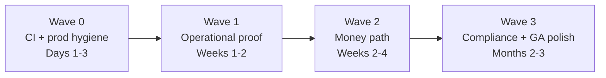

# Full Remediation Plan — Selva Office + selva.town

> **Status:** Active (2026-06-22)
> **Owner:** Selva engineering + MADFAM platform operator
> **Supersedes:** Nothing — this is the **master execution index** that sequences
> existing SSOT docs with live prod/codebase findings from 2026-06-22.

---

## How to use this document

| If you need… | Read… |
|--------------|-------|
| **This plan** — waves, calendar, exit gates, live prod snapshot | This doc |
| **GTM strategy, wedges, competitive positioning** | [COMMERCIAL_GA_STRATEGY_AND_IMPLEMENTATION_2026-06-22.md](./COMMERCIAL_GA_STRATEGY_AND_IMPLEMENTATION_2026-06-22.md) |
| Sprint schedule + engineering backlog | [PHASE_0_REMEDIATION_PLAN.md](./PHASE_0_REMEDIATION_PLAN.md) |
| Commercial GA no-go gates (CGA-0..9) | [COMMERCIAL_GA_REMEDIATION_PLAN_2026-06-04.md](./COMMERCIAL_GA_REMEDIATION_PLAN_2026-06-04.md) |
| Human-gated operator actions | [OPERATOR_BACKLOG.md](./OPERATOR_BACKLOG.md) |
| North star (Phases 0–6) | [AUTONOMOUS_OPERATIONS_PROGRAM.md](./AUTONOMOUS_OPERATIONS_PROGRAM.md) |
| Day-by-day tactical status | [REMEDIATION_EXECUTION_PLAN_2026-06-04.md](./REMEDIATION_EXECUTION_PLAN_2026-06-04.md) |

**Decision rule (unchanged):** Do not declare broad tenant commercial GA or scale
outbound automation until **Wave 1 exit** (Phase 0 checklist) and **Wave 2 revenue
proof** are evidenced.

---

## Live snapshot — 2026-06-22

### selva.town prod (read-only probes)

| Surface | Status | Notes |
|---------|--------|-------|
| `selva.town` | ✅ 200 | Landing page |
| `api…/health/ready` | ✅ 200 | DB + Redis OK |
| `ws.selva.town/health` | ✅ 200 | Colyseus healthy (public) |
| `gw.selva.town/health` | ✅ 200 | Gateway ~18d uptime, heartbeat ticking |
| `api…/health/rls-status` | ✅ 200 | `strict_mode_enabled: true` |
| Task queue | ✅ Healthy | DLQ 0, pending 0 |
| `api…/health/detail` | ⚠️ degraded | Colyseus internal check failed — **missing `COLYSEUS_URL` in prod** |
| `api…/consent-ledger-grants` | ⚠️ 503 | Grant probe used wrong role default — **fixed in repo (Wave 0.2)** |

### Codebase

| Signal | Status |
|--------|--------|
| GA-001..008 (Wave 0 correctness) | ✅ Closed at repo level |
| `main` CI | ❌ Red since **2026-06-03** (Trivy CVEs) — **fix in Wave 0.1** |
| k6 Runs 1–4 | ❌ Hard thresholds not passed |
| OTel traces in prod | ❌ Zero |
| Sentry capture in prod | ❌ DSNs unset |

### Readiness estimates (2026-06-04 baseline, still valid)

| Scope | Estimate |
|-------|----------|
| MADFAM tenant slice in prod | ~85–90% |
| Production-truthful Selva | ~88–92% |
| Full commercial GA (all tenants) | ~58–65% |

---

## Milestones

| ID | Milestone | Definition of done |
|----|-----------|-------------------|
| **M0** | Merge gate green | `main` CI passes (lint, test, build, Trivy) |
| **M1** | Phase 0 exit | Phase 0 checklist scripts all green with dated evidence |
| **M2** | Prod observable | OTel dispatch trace + Sentry per service + SLO dashboards live |
| **M3** | Prod resilient | k6 Run 4b thresholds pass + DR drill RTO/RPO logged |
| **M4** | Revenue loop | One attributed paid conversion end-to-end |
| **M5** | Commercial GA | CGA-0..9 checklist complete |

---

## Wave map



---

## Wave 0 — CI + prod hygiene (Days 1–3)

**Goal:** Restore engineering velocity; fix prod health degradations that need no vendor pick.

### 0.1 Unblock CI (engineering)

| Action | Package | Target |
|--------|---------|--------|
| Bump PyJWT | `pyjwt` | ≥2.13.0 (CVE-2026-48526) |
| Bump multipart parser | `python-multipart` | ≥0.0.30 (CVE-2026-53539) |
| Bump ASGI layer | `starlette` | ≥1.3.1 (CVE-2026-54283) via `selva-nexus-api` dep |
| Workspace constraints | `pyproject.toml` `[tool.uv] constraint-dependencies` | Pin all three |

**Acceptance:** Green `CI` workflow on `main`. Archive run URL in session evidence.

**Evidence script:** `gh run list --workflow=ci.yml --branch main --limit 3`

### 0.2 Prod health probe fixes (engineering + operator)

| Issue | Root cause | Fix |
|-------|------------|-----|
| `health/detail` colyseus unavailable | `COLYSEUS_URL` unset in nexus-api pod (defaults to localhost) | Set `COLYSEUS_URL: http://colyseus` in prod configmap + staging patch |
| `consent-ledger-grants` 503 | Probe used non-existent role `selva`; prod connects as `selva_app` | Probe `current_user` by default; optional `CONSENT_LEDGER_APP_ROLE` override |
| Doc-truth gaps | Script didn't check internal colyseus or consent probes | Extend `./scripts/verify-doc-truth.sh` |

**Acceptance:** Post-promote `./scripts/verify-doc-truth.sh` passes including colyseus + consent checks.

### 0.3 Wave 0 regression guard (engineering)

GA-001..008 tests remain merge blockers. See [CI_TEST_SCOPE.md](./CI_TEST_SCOPE.md).

---

## Wave 1 — Operational proof (Weeks 1–2)

**Goal:** Close Phase 0 gates 0.1–0.5. Prod becomes **debuggable** and **measurable**.

**Operator runbook:** [WAVE1_OPERATOR_RUNBOOK.md](./WAVE1_OPERATOR_RUNBOOK.md)

**Orchestrator:** `./scripts/run-wave1-gates.sh --staging [--require-all]`

### 1.1 OTel (Operator + Eng) — [OPERATOR_BACKLOG §1](./OPERATOR_BACKLOG.md)

1. Pick vendor ([OBSERVABILITY_VENDOR_SELECTION.md](./OBSERVABILITY_VENDOR_SELECTION.md))
2. `scripts/bootstrap-staging-observability.sh` → staging, then prod
3. Set `OTEL_EXPORTER_OTLP_ENDPOINT` on all 6 deployments
4. `./scripts/verify-observability-trace.sh --require-trace`

### 1.2 Sentry (Operator + Eng) — [OPERATOR_BACKLOG §2](./OPERATOR_BACKLOG.md)

1. Create 6 Sentry projects + DSNs
2. Set GitHub `SENTRY_AUTH_TOKEN` + `SENTRY_ORG` for source maps
3. Synthetic staging error per service
4. `./scripts/verify-staging-observability.sh` → OK (not SKIP)

### 1.3 k6 Run 4b (Eng + Operator) — [LOAD_TEST_2026-Q2.md](./LOAD_TEST_2026-Q2.md)

```bash
./scripts/drain-staging-task-queue.sh
kubectl apply -k infra/k8s/overlays/staging-load
./scripts/verify-staging-load-run4b-preflight.sh --require-live
./scripts/run-staging-load-calibration.sh
kubectl apply -k infra/k8s/overlays/staging   # revert
```

**Hard thresholds:** errors <0.5%, p99 dispatch <1500ms, DLQ <5 in 5min.

### 1.4 DR drill (Operator) — [DISASTER_RECOVERY.md](./DISASTER_RECOVERY.md)

```bash
./scripts/run-db-restore-drill.sh --preflight
DR_DRILL_EXECUTE=yes ./scripts/run-db-restore-drill.sh --execute
./scripts/verify-dr-drill-evidence.sh
```

### 1.5 Staging completion (Operator)

- Janua staging OAuth client
- `./scripts/reconcile-dhanam-selva-webhook.sh` (idempotent)

---

## Wave 2 — Money path + controlled promote (Weeks 2–4)

**Goal:** Phase 1 exit — one attributed paid conversion.

### 2.1 Dhanam billing — [OPERATOR_BACKLOG §3](./OPERATOR_BACKLOG.md)

- Map Stripe price IDs → tiers in Dhanam catalog (prod + staging)
- `./scripts/verify-dhanam-price-tier-map.sh --staging --require-all`
- `./scripts/verify-dhanam-billing-path.sh --staging`

### 2.2 Revenue loop proof

```
CRM lead → dispatch → email → HITL → send → Dhanam checkout → webhook → tier cache → CFDI
```

**Exit:** Documented row with `lead_id`, `customer_id`, `org_id`, tier before/after.

### 2.3 Prod promote gate

Only after Wave 1 exit + ≥30min staging soak:

```bash
./scripts/verify-phase0-gates.sh --staging
env -u AUTH_TOKEN ./scripts/verify-campaign-loop.sh --staging
# workflow_dispatch: promote-to-prod.yml (pointer update only)
./scripts/verify-doc-truth.sh
```

---

## Wave 3 — Compliance, product GA, autonomy (Months 2–3)

| Track | Items | Doc |
|-------|-------|-----|
| Audit / CDC | RFC 0019 Phase A | [AUDIT_TRAIL_GAP_ANALYSIS.md](./AUDIT_TRAIL_GAP_ANALYSIS.md) |
| A2A tenants | RFC 0018 Phase D | Before paying A2A callers |
| MX residency | RFC 0020 | SAT-bound tenants |
| Product polish | Non-MADFAM onboarding, billing UI, live-mode guards | [COMMERCIAL_GA plan Wave 4](./COMMERCIAL_GA_REMEDIATION_PLAN_2026-06-04.md) |
| Autonomy | ASK→ALLOW after 30-day clean run per lane | [AUTONOMOUS_OPERATIONS_PROGRAM.md § Phase 6](./AUTONOMOUS_OPERATIONS_PROGRAM.md) |

---

## Phase 0 exit checklist

Run from repo root after Wave 1:

```bash
./scripts/verify-doc-truth.sh
./scripts/staging-smoke.sh
./scripts/verify-staging-observability.sh                    # OK, not SKIP
./scripts/verify-observability-trace.sh --require-trace
./scripts/verify-dhanam-billing-path.sh --staging
./scripts/verify-dhanam-price-tier-map.sh --staging --require-all
./scripts/verify-staging-load-run4b-preflight.sh --require-live
./scripts/verify-dr-drill-evidence.sh
./scripts/verify-secret-rotation-schedule.sh
env -u AUTH_TOKEN ./scripts/verify-campaign-loop.sh --staging
./scripts/run-staging-load-calibration.sh                    # Run 4b pass
# CI green on main
# DR drill row in docs/DISASTER_RECOVERY.md
```

---

## 4-week calendar

| Week | Focus | Deliverables |
|------|-------|--------------|
| **W0** (2026-06-22) | Wave 0 | Green CI, COLYSEUS_URL + consent probe fixes, verify-doc-truth extended |
| **W1** | Wave 1a | OTel + Sentry on staging; trace + synthetic errors |
| **W2** | Wave 1b | Run 4b pass + DR drill |
| **W3** | Wave 2a | Dhanam mapping + staging revenue loop |
| **W4** | Wave 2b | Phase 0 exit bundle → controlled prod promote |

---

## RACI

| Workstream | Engineering | Operator | Enclii |
|------------|-------------|----------|--------|
| CI / CVE fixes | **R/A** | I | I |
| Prod health env (COLYSEUS_URL) | R | **A** | R (promote) |
| OTel + Sentry | C | **R/A** | R |
| k6 Run 4b | **R** | A | C |
| DR drill | C | **R/A** | I |
| Dhanam billing | C | **R/A** | I |
| Prod promote | C | **R/A** | R |

---

## Enclii adapter gaps (record, do not normalize)

| Gap | Workaround | Target adapter |
|-----|------------|----------------|
| Staging migrations | `scripts/run-staging-migrations.sh` | Enclii pre-deploy hook |
| Observability secrets | `scripts/bootstrap-staging-observability.sh` | Enclii secret provisioning |
| Dhanam webhook drift | `scripts/reconcile-dhanam-selva-webhook.sh` | Dhanam durable config |
| Run 4b scale overlay | `infra/k8s/overlays/staging-load` | Enclii load-test mode |

---

## Weekly scorecard

| Metric | Baseline (Jun 22) | Phase 0 exit target |
|--------|-------------------|---------------------|
| CI green on `main` | ❌ 19 days red | ✅ 7 consecutive days |
| Prod distributed traces | 0 | ≥1 dispatch trace |
| Sentry services capturing | 0/6 | 6/6 |
| k6 Run 4b | Failed | Pass |
| DR drill evidence | None | RTO/RPO logged |
| Commercial GA estimate | ~58–65% | ~75% |

---

## Explicit deferrals

- PP.5 prod Argo cutover until Phase 0 exit
- Broad tenant GA marketing until M5
- `FEATURE_STRIPE_MXN_LIVE` until Dhanam path proven
- Autonomy ASK→ALLOW until 30-day clean runs
- Full workspace pytest on every PR (non-PR gate per CI_TEST_SCOPE)

---

## Changelog

| Date | Change |
|------|--------|
| 2026-06-22 | Wave 1 engineering: sentry-probe endpoint, multi-service observability verifiers, `run-wave1-gates.sh`, prod bootstrap wrapper, [WAVE1_OPERATOR_RUNBOOK.md](./WAVE1_OPERATOR_RUNBOOK.md) |
| 2026-06-22 | Initial master plan from stability audit; Wave 0.1–0.2 engineering shipped (CVE bumps, health probes, verify-doc-truth, COLYSEUS_URL config) |
